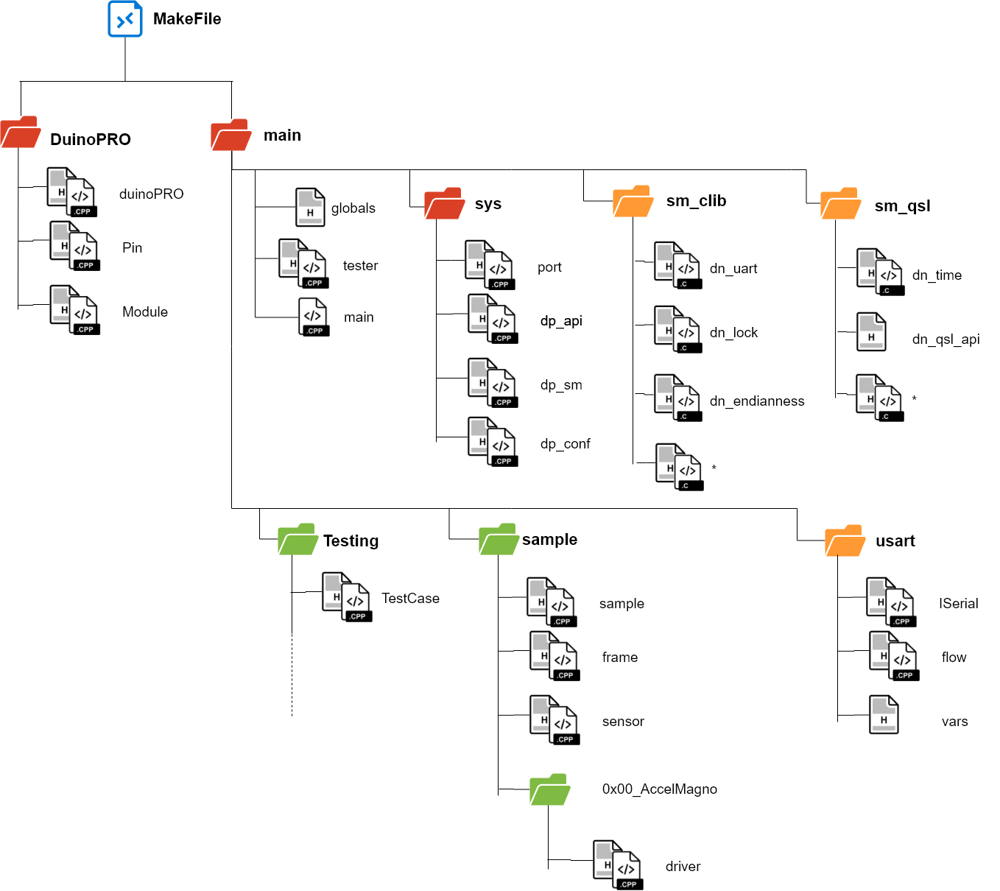

*****************
Code Organization
*****************

.. note::

   This is crucial in understanding how to contribute to the Sensor-Host code base.

The codebase for the sensor-host is organised as follows:

   Code organisation of Sensor Host

CSC has developed all files located in ``main/``, with ATAMO developing the libraries
in ``DuinoPRO``.

The Atmel Studio 7 solution file (``.atsln``) loads the code base target at the ``Makefile``
at the Top-Level Directory (TLD).

Entry Point
===========

The sensor-host's program main entry point is at ``main/main.cpp``; depending on
the ``DP_BUILD__TEST_MODE`` setting, control of the main loop may be yielded to ``tester.cpp`` for
testing.

Globals
=======

The ``globals.h`` header file is responsible for ensuring that key system resources are shared
throughout

In particular:

.. code-block:: c

    /*******************************************************************************
     * Singletons/Globals
     ******************************************************************************/
    extern duinoPRO Board;
    extern sys_state SystemState;
    extern char sys_conf[DP_LUT__N_PARAM];
    extern dp_payload_t dp_payload;

.. warning::

   However, it is crucial that resources are only used where they are permitted. This
   prevents resource deadlock or unexpected behavior

For example, ``sys_conf`` is considered **private** and configurations **must** be accessed
by external modules through the ``sys/dp_conf`` module.

In general, the ``sys`` modules (System Core Layer) will expose key resources publicly,
whilst privately handling key resources to prevent system deadlock.
