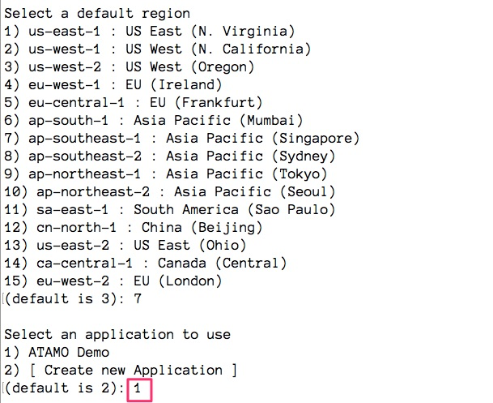

*****************************
Deploying the Web Application
*****************************

Setup
=====

This section pertains to the setup of the Django web application using Elastic Beanstalk and a Linux operating system. A more general guide (including setup using Windows) can be found in
`AWS documentation`_.

.. _AWS documentation: https://docs.aws.amazon.com/elasticbeanstalk/latest/dg/create-deploy-python-django.html

This guide was made using `Python version 2.7.10`. After downloading the DustyDjango code from `here`_. Navigate to terminal, and install the  ``virtualenv`` package using:

.. _here: https://github.com/CloudSevenConsulting/DustyDjango.

.. code-block:: bash

    pip install virtualenv

``virtualenv`` is a tool to create isolated Python environments. More information about the package can be found `here <https://virtualenv.pypa.io/en/stable/>`_.

Next we create a new ``virtualenv`` called ``atamo`` via:

.. code-block:: bash

    source virtualenv ~/atamo

To activate the ``virtualenv``, run:

.. code-block:: bash

    source atamo/bin/activate

You will see (``atamo``) prepended to your command prompt, indicating that you're in a virtual environment. Install the required version of django using:

.. code-block:: bash

    (atamo)~$ pip install django==1.10.8

Verify installation of packages at any time using  `pip freeze`, which now should display:

.. code-block:: bash

    (atamo)~$ pip freeze
    Django==1.10.8

Change directories into the project application (downloaded previously - `DustyDjango <https://github.com/CloudSevenConsulting/DustyDjango>`_). In this example the directory where the project is currently stored is called ``atamoapp_demo``. To change directory, use:

.. code-block:: bash

    (atamo)~$ cd atamoapp_demo

Your directory (here called ``atamoapp_demo``) should have now have a layout similar to:

.. code-block:: bash

    atamoapp_demo/
     ├ manage.py
     ├ .db.sqlite3
     ├ [DIR] mysite
     ├ [DIR] blog

The following dependencies are needed for the proper functioning of the application. Verify the following packages are installed using ``pip freeze``. If the following packages are not installed, install them using ``pip install `` followed by the desired package and version number download.

.. code-block:: bash

    pip freeze
    boto3==1.4.7
    botocore==1.7.33
    certifi==2017.7.27.1
    chardet==3.0.4
    decorator==4.1.2
    Django==1.10.8
    django-allauth==0.33.0
    docutils==0.14
    enum34==1.1.6
    functools32==3.2.3.post2
    futures==3.1.1
    idna==2.6
    ipython-genutils==0.2.0
    jmespath==0.9.3
    jsonschema==2.6.0
    jupyter-core==4.3.0
    nbformat==4.4.0
    oauthlib==2.0.4
    plotly==2.1.0
    python-dateutil==2.6.1
    python-openid==2.2.5
    pytz==2017.2
    requests==2.18.4
    requests-oauthlib==0.8.0
    s3transfer==0.1.11
    six==1.11.0
    traitlets==4.3.2
    urllib3==1.22

Deployment
==========

This section pertains to the deployment of the Django web application using Elastic Beanstalk and a Linux operating system. A more general guide (including setup using Windows) can be found in
`AWS documentation <https://docs.aws.amazon.com/elasticbeanstalk/latest/dg/create-deploy-python-django.html>`_.

After following the above set-up has been complete, you are now ready to deploy via Elastic Beanstalk. To do so, you will first need to ensure you have ``Git`` installed on your machine.

Activate your previously created ``virtualenv`` using:

.. code-block:: bash

    source atamo/bin/activate

Change to your project directory:

.. code-block:: bash

    (atamo)~$ cd atamoapp_demo

If this is your first time deploying an application via Elastic Beanstalk, first download the `command line interface <https://docs.aws.amazon.com/elasticbeanstalk/latest/dg/eb-cli3-install.html>`_. As in this example we are connecting to an existing app, the deployment instructions differ from a fresh deployment. Please see `Elastic Beanstalk documentation <https://docs.aws.amazon.com/elasticbeanstalk/latest/dg/using-features.deploy-existing-version.html>`_ if you wish to deploy a **_brand new_** application.

Next run:

.. code-block:: bash

    (atamo)~$ eb init -i

Which will prompt you to select a default region. Type the number ``7`` (*which corresponds to ap-southeast-1*). It will then prompt you to select an application: Choose ``ATAMO Demo``.

Once you've successfully established the connection, you just need to commit your changes to ``Git``.

.. code-block:: bash

    (atamo)~$ git init
    (atamo)~$ git add .
    (atamo)~$ git commit -m “First commit”

Where "First commit" is any commit message that you desire. Please ensure you include an appropriate ``.gitignore`` file for any additional files you do not wish to deploy live. Finally, run:

.. code-block:: bash

    (atamo)~$ eb deploy

Which will **deploy your application**. If you are not automatically redirected to the URL, use:

.. code-block:: bash

    (atamo)~$ eb open

